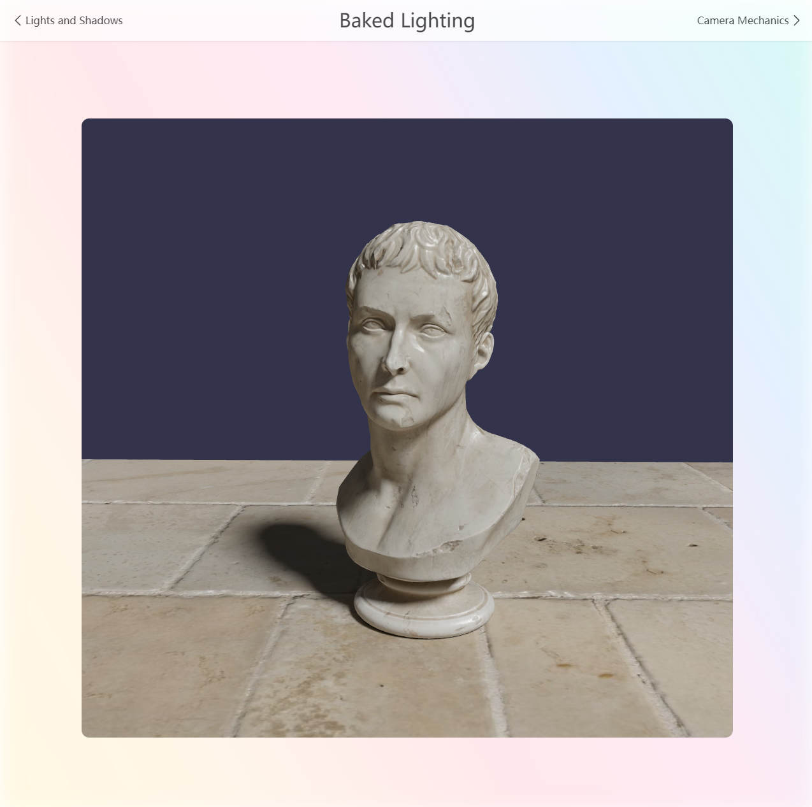

### Intro

> 14 examples about WebGL/WebGPU powered by babylonjs.

- Basic Scene
- Standard Materials
- PBR
- Custom Models
- Lights and Shadows
- Baked Lighting
- Camera Mechanics
- Mesh Actions
- First Person Controller
- Collisions and Triggers
- Physics Velocity
- Physics Forces
- Ray Casting



### How to use

```bash
pnpm i
pnpm dev
```
